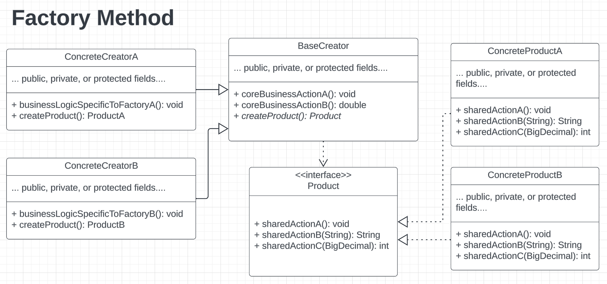
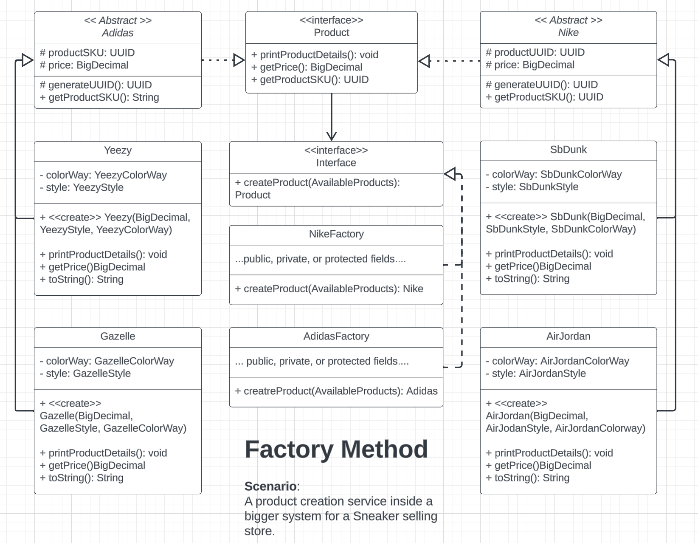

# Design Patterns - Creational - Factory Method
> A *creational* design pattern which allows a parent/superclass
> to produce various object types that have a shared interface.
>
> Removes tight coupling of direct object creation calls in the
> client/calling code, and encapsulates object creation logic 
> in a special *factory method*.

## Problem: App Requires More Reference Types For Business Needs

Assume a sneaker/shoe selling company has a platform for selling various kinds of sneaker styles and brands.
The company's system currently utilizes an initial version of the product creation service; unfortunately, the product
creation service only supports selling one brand and one style - namely, `Nike` (brand) and `SbDunk` (style).

After a very good first year in sales with a large margin of growth in profits, the comapny is looking to expand their
product catalog by adding more well-known brands and styles. They want to include various new Nike-based styles and 
carry a new brand. To support these new business requirements, v1.0.0 of the product service must be updated.
 
The comapny's developers are tasked to modify the existing production creation service to now include the following: 

1. Two Brands: Adidas, Nike
2. Adidas Styles: Gazelle, Yeezy, Sambda
3. Nike Styles: AirForce, AirJordan, SbDunk

The development team begins adding new class types for the above. They then start using switch statements (or chaining of if-else statements)
to conditionally create objects. However, the team quickly realizes that this method of adding new products will become unweidly in the long-term. 
That is because each new product that must be added now requires two things:

1) a object contruction call - `new <productName>()` (when the object is to be created)
2) conditional logic to determine which object to create (overusing switch or if-else statements in client code)

Moreover, the team begins to notice that the codebase becomes increasingly harder to change since the Client code is tightly couple to concrete/direct 
type references to objects, namely: AirJordan, AirForce, SbDunk, Gazelle, Yeezy, and Samba.

Understanding the production service will be hard to maintain in the future if this pattern continues, the developers set out to find a way to create 
multiple types of objects without having to rewrite a bunch of the client code. After doing some research on software design,
the team settles upon rewriting the product creation service using a **Factory Method Pattern**.

## Solution: The Factory Method

The Factory Method pattern suggests that all tightly coupled object creation calls (i.e. `new <someObjectName>()`) are replaced by a special **factory method**. The Client code can now call a factory method to produce the correct objects, without littering the Client code with a bunch of conditional logic.

This is great since the Client code now contains less code and becomes more readable; however, one problem remains - how to make the Client code work with any of the objects that will be returned by the factory method?

To solve this, this design pattern enforces that all "products" (the various kinds of shoes in this scenario) implement a **shared interface**. Thus, allowing the Client code to work with any object as long as it implements the shared interface.

Due to polymorphism, the Client code will be able to recognize the underlying type to work with during runtime.

## Pattern Anatomy
1. Interface that is common to all objects to be created
2. Concrete objects that represent the various "products" to create
3. Base Creator class which delcares a factory method to override
  - returns new objects with the same type as the shared interface
  - can be designed to reuse existing objects
  - do note, the creator class typically has other core business logic
    - not just responsible for object creation
4. Concrete Creator classes which over the base Creator
  - override the factory method to produce certain objects
    relative to that factory.

## Structure

### Generic Setup

### Implementation Example

## How To Implement
1. Make all "products" follow the shared interface
    - the interface should have methods that make sense for all products 

2. Add empty factory method inside the *base creator* class
    - the return type of the method should be the shared interface

3. Remove all objection construction calls (via `new`) from client code
    - place the object construction statements inside the factory method
 
4. Replace the direct object calls with the factory method in client code

5. Create *concrete* creator classes, which inherit the base creator class
    - these classes create products of a specific kind 
    - place the specific product creation code inside this class's factory method
  
6. If no more object creation logic existing in the base creator class after step 5, make the base creator class **abstract**

## Pros & Cons
- Pros:
  - avoid tight coupling between creator & concrete products
  - object creation is now in centralized places (follows SRP)
  - can introduce new object types without breaking existing calling code(follows OCP)

- Cons:
  - more boilerplace code
  - can increase complexity of the software design if not done properly

## Use When
- don't know the exact types & dependencies between objects
- want to provide users a way to extend internal components of a library
- save system resources via reusing existing objects
  - the factory method can resuse obejcts too, not just create new ones

## Relations with Other Patterns
- Factory method is a good starting point for new applications
  - can move to Abstract Factory, Prototype, or Builder later on

- Abstract Factory is usually based on a set of Factory Methods

- Can use Iterator + Factory Method to return different iterators
  compatible with subclass collections

- Factory method is a specialized *Template method*
  - can serve as a single step inside a template method pattern
