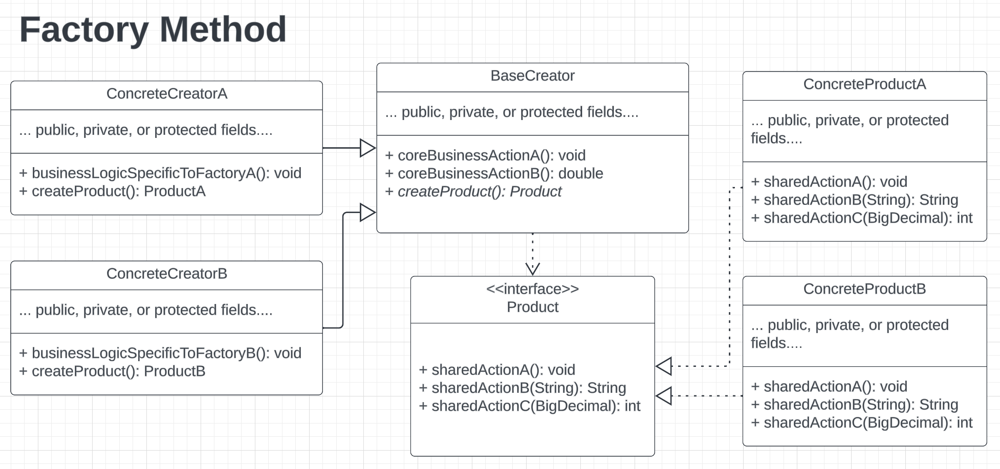

# Design Patterns - Creational - Factory Method
> A *creational* design pattern which allows a parent/superclass
> to produce various object types that have a shared interface.
>
> Removes tight coupling of direct object creation calls in the
> client/calling code, and encapsulates object creation logic 
> in a special *factory method*.

## Problem: App Requires More Reference Types For Business Needs

Assume a sneaker selling company is making a platform to handle selling various kinds of sneakers. Initially, the company only sold one type of Nike Sneakers - Nike Sb Dunks. However, after a good first year, the company decides to spend their revenue to invest in other Nike sneakers to sell on their platform, namely: Air Jordans and Air Forces. 

The developers are tasked to modify the existing selling platform to now include Air Jordans and Air Forces as products that can be sold. While analyzing the system, the developers being to add switch statements in the cleint code to create the correct objects - AirJordan, AirForce, or SbDunk. 

However, the development team quickly realizes that this method of adding new products will become unweidly in the long-term. The reason, is becauseeach new product that must be added requires two things:

1) a object contruction call - `new <productName>()`
2) conditional logic to determine which object to create

Moreover, the development team notices that the codebase is hard to change since the Client code is tightly couple to concrete types of objects, namely: AirJordan, AirForce, SbDunk. 

The developers set out to find a way to create multiple types of objects
without having to rewrite a bunch of the client code...

## Solution: The Factory Method

This design pattern suggets that all tightly coupled object creation calls(i.e. `new <someObjectName>()`) are swapped out for a special **factory method**. The Client code can now call a factory method to produce the correct objects, without littering the Client code with a bunch of conditional logic.

This is great since the Client code now contains less code and becomes more readable; however, one problem remains - how to make the Client code work with any of the objects that will be returned by the factory method?

To solve this, this design pattern enforces that all "products" (the various kinds of shoes in this scenario) implement a **shared interface**. Thus, allowing the Client code to work with any object as long as it implements the shared interface.

Due to polymorphism, the Client code will be able to recognize the underlying type to work with during runtime.

## Pattern Anatomy
1. Interface that is common to all objects to be created
2. Concrete objects that represent the various "products" to create
3. Base Creator class which delcares a factory method to override
  - returns new objects with the same type as the shared interface
  - can be designed to reuse existing objects
  - do note, the creator class typically has other core business logic
    - not just responsible for object creation
4. Concrete Creator classes which over the base Creator
  - override the factory method to produce certain objects
    relative to that factory.

## Structure

## How To Implement
1. Make all "products" follow the shared interface
    - the interface should have methods that make sense for all products 

2. Add empty factory method inside the *base creator* class
    - the return type of the method should be the shared interface

3. Remove all objection construction calls (via `new`) from client code
    - place the object construction statements inside the factory method
 
4. Replace the direct object calls with the factory method in client code

5. Create *concrete* creator classes, which inherit the base creator class
    - these classes create products of a specific kind 
    - place the specific product creation code inside this class's factory method
  
6. If no more object creation logic existing in the base creator class after step 5, make the base creator class **abstract**

## Pros & Cons
- Pros:
  - avoid tight coupling between creator & concrete products
  - object creation is now in centralized places (follows SRP)
  - can introduce new object types without breaking existing calling code(follows OCP)

- Cons:
  - more boilerplace code
  - can increase complexity of the software design if not done properly

## Use When
- don't know the exact types & dependencies between objects
- want to provide users a way to extend internal components of a library
- save system resources via reusing existing objects
  - the factory method can resuse obejcts too, not just create new ones

## Relations with Other Patterns
- Factory method is a good starting point for new applications
  - can move to Abstract Factory, Prototype, or Builder later on

- Abstract Factory is usually based on a set of Factory Methods

- Can use Iterator + Factory Method to return different iterators
  compatible with subclass collections

- Factory method is a specialized *Template method*
  - can serve as a single step inside a template method pattern
