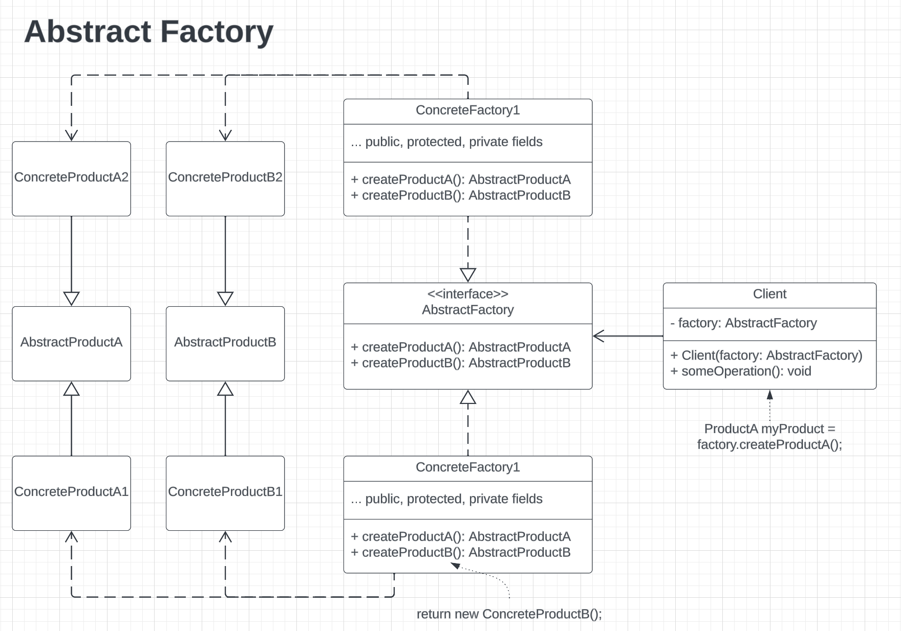

# Design Patterns - Creational - Abstract Factory
> A **creational** design pattern that enables the production of
> a set of related objects without explicitly specficying the underlying
> concrete classes.

## Problem: App Requires More Reference Types For Business Needs

## Solution: The Factory Method

## Pattern Anatomy
1. **Abstract Product** classes (or interfaces)
  - declares functionality for sets of related product types  
  - each abstract produce must be implemented in all product variants

2. **Concrete Product** classes
  - various implementations of the abstract products
  - grouped by variant
  
3. **Abstract Factory** interface
  - declares set of methods for creating each abstract product type
  
4. **Concrete Factory** classes
  - implements the creation methods from the abstract factory interface
  - each factory correseponds to a specific variant of products
    - only creates those product variants 
  - the factory methods MUST return corresponding **abstract products**
    - if not, the pattern doesn't work since a direct dependency
      on concrete types would still exist in the calling/client code
  
## Structure

## How To Implement
1. Create a matrix of product types & variants (find all combinations)
2. Describe interfaces for all product types.
3. Make concrete products implement the interfaces
4. Implement a set of concrete factory methods (for each product variant)
5. Create factory initializtion code somewhere in the application
  - will instantiate only one of the concrete factory classes to use
    for the entire program
  - can be configured via startup/environemnt variables for the app
6. Pass the configured factory object to all classes that produce products
  - do this via constructor dependency injection (DI)
7. Replace direct object creation calls in client/calling code with
   the new concrete factory object. Make sure to generate create
   underlying product type.

## Pros & Cons
- Pros:
  - ensures objects created via factory are all compatible with each other
  - avoid tight coupling between concrete products & client/calling code
  - encapsulate object creation logic into a single place (follows SRP)
  - can introduce new product variants without breaking client/calling code (follows OCP)

- Cons:
  - more boilerplate required (more interfaces & subclasses)
  - can increased complexity if used improperly or when not needed

## Use When
- app needs to work with sets of related products but DO NOT want to 
  depend on concrete classes (i.e. direct types) for those products.
  - possible becase they are unknown beforehand
  - or just wanting to provide flexibility for future extension to app 

- using a set of factory methods that start violating SRP
  - the factory methods start trying to do more than one thing

## Relations with Other Patterns
- Can be used as the next step of the *factory method* pattern

- Abstract Factory versus Builder:
  - creates sets of realated objects versus single obejcts (builder)
  - returns objects immediately instead of additional construction
    logic, which builder pattern provideso

- Abstract factory classes often based on a set of **factory methods**
  - can also utilize Prototype pattern to compose object creation methods  
- Can be an alternative to the Facade pattern, when:
  - only needing to hide object creation logic from Client/calling code

- Utilize with the **bridge** pattern when:
  - some bridge abstractions can only work with specific implementations
  - **abstract factory** encapsulates relatinos & hides complexity from
    calling code

- Abstract factory can be implemented as a **singleton**
